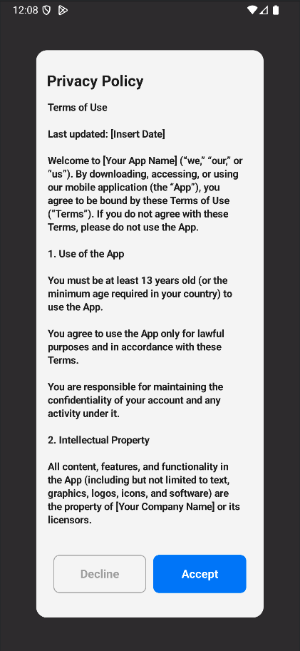

# AgreementKit Android 📱

[](https://jitpack.io/#ControlKit/AgreementKit-Android)
[](https://android-arsenal.com/api?level=24)
[](https://kotlinlang.org)
[](LICENSE)

A modern, customizable Android library for displaying Terms and Conditions, Privacy Policies, and other agreement dialogs with beautiful UI components built with Jetpack Compose.

## ✨ Features

- 🎨 **Beautiful UI**: Modern Material Design 3 components
- 🔧 **Highly Customizable**: Colors, fonts, layouts, and styling options
- 🌍 **Multi-language Support**: Built-in internationalization
- 🔄 **API Integration**: Dynamic content loading from your backend
- 📊 **Analytics Ready**: Track user interactions and agreement status
- 🛡️ **Secure**: Built-in security features and data encryption
- ⚡ **Lightweight**: Minimal dependencies and optimized performance
- 🧪 **Well Tested**: Comprehensive test coverage

## 📸 Screenshots



## 🚀 Quick Start

### Installation

Add JitPack repository to your project's `build.gradle`:

```gradle
allprojects {
    repositories {
        maven { url 'https://jitpack.io' }
    }
}
```

Add the dependency to your app's `build.gradle`:

```gradle
dependencies {
    implementation 'com.github.ControlKit:AgreementKit-Android:0.0.1'
}
```

### Basic Usage

```kotlin
import com.sepanta.controlkit.agreementkit.agreementKitHost
import com.sepanta.controlkit.agreementkit.service.config.AgreementServiceConfig
import com.sepanta.controlkit.agreementkit.view.config.AgreementViewConfig
import com.sepanta.controlkit.agreementkit.view.config.AgreementViewStyle

class MainActivity : ComponentActivity() {
    override fun onCreate(savedInstanceState: Bundle?) {
        super.onCreate(savedInstanceState)
        
        setContent {
            val agreementKit = agreementKitHost(
                config = AgreementServiceConfig(
                    version = "1.0.0",
                    appId = "your-app-id",
                    name = "Privacy Policy",
                    viewConfig = AgreementViewConfig(
                        viewStyle = AgreementViewStyle.Popover1
                    )
                ),
                onDismiss = {
                    // Handle dialog dismissal
                },
                onState = { state ->
                    // Handle state changes
                }
            )
            
            // Show the agreement dialog
            agreementKit.showView()
        }
    }
}
```

## 📖 Documentation

- [Quick Start](docs/QUICK_START.md) - Get started in 5 minutes
- [Setup Guide](docs/SETUP.md) - Detailed installation and setup instructions
- [Configuration](docs/CONFIGURATION.md) - Complete configuration options
- [Usage Examples](docs/USAGE_EXAMPLES.md) - Various usage scenarios
- [API Reference](docs/API_REFERENCE.md) - Complete API documentation
- [FAQ](docs/FAQ.md) - Frequently asked questions

## 🔧 Configuration

### Service Configuration

```kotlin
AgreementServiceConfig(
    version = "1.0.0",                    // App version
    appId = "your-unique-app-id",         // Your app identifier
    name = "Privacy Policy",              // Agreement name
    lang = "en",                          // Language code
    deviceId = "custom-device-id",        // Optional custom device ID
    timeOut = 5000L,                      // API timeout in milliseconds
    timeRetryThreadSleep = 1000L,         // Retry delay
    maxRetry = 5,                         // Maximum retry attempts
    viewConfig = AgreementViewConfig(...) // UI configuration
)
```

### View Configuration

```kotlin
AgreementViewConfig(
    viewStyle = AgreementViewStyle.Popover1,
    
    // Dialog appearance
    popupViewBackGroundColor = Color.White,
    popupViewCornerRadius = 15.dp,
    
    // Header customization
    headerTitle = "Terms of Service",
    headerTitleColor = Color.Black,
    
    // Content styling
    termsTitle = "Please read our terms...",
    termsTitleViewStyle = Typography.bodyMedium,
    
    // Button customization
    acceptButtonTitle = "Accept",
    declineButtonTitle = "Decline",
    acceptButtonColor = Color.Blue,
    declineButtonColor = Color.Transparent,
    
    // Custom views (optional)
    headerTitleView = { title ->
        Text(
            text = title,
            style = MaterialTheme.typography.headlineSmall,
            color = MaterialTheme.colorScheme.primary
        )
    }
)
```

## 🎯 Use Cases

### 1. Privacy Policy Agreement
```kotlin
val privacyPolicyKit = agreementKitHost(
    AgreementServiceConfig(
        version = "1.0.0",
        appId = "your-app-id",
        name = "Privacy Policy",
        viewConfig = AgreementViewConfig(
            headerTitle = "Privacy Policy",
            acceptButtonTitle = "I Agree",
            declineButtonTitle = "Cancel"
        )
    )
)
```

### 2. Terms of Service
```kotlin
val termsKit = agreementKitHost(
    AgreementServiceConfig(
        version = "1.0.0",
        appId = "your-app-id",
        name = "Terms of Service",
        viewConfig = AgreementViewConfig(
            headerTitle = "Terms of Service",
            acceptButtonTitle = "Accept Terms",
            declineButtonTitle = "Decline"
        )
    )
)
```

### 3. Custom Styled Agreement
```kotlin
val customKit = agreementKitHost(
    AgreementServiceConfig(
        version = "1.0.0",
        appId = "your-app-id",
        name = "User Agreement",
        viewConfig = AgreementViewConfig(
            popupViewBackGroundColor = MaterialTheme.colorScheme.surface,
            headerTitleColor = MaterialTheme.colorScheme.primary,
            acceptButtonColor = MaterialTheme.colorScheme.primary,
            declineButtonColor = MaterialTheme.colorScheme.outline,
            popupViewCornerRadius = 20.dp
        )
    )
)
```

## 🔄 State Management

The library provides comprehensive state management:

```kotlin
agreementKitHost(
    config = config,
    onState = { state ->
        when (state) {
            is AgreementState.Initial -> {
                // Initial state
            }
            is AgreementState.ShowView -> {
                // Agreement content loaded
                val agreementData = state.data
            }
            is AgreementState.Action -> {
                // User action performed
                val action = state.data
            }
            is AgreementState.NoContent -> {
                // No agreement content available
            }
            is AgreementState.Error -> {
                // Error occurred
                val error = state.data
            }
        }
    }
)
```

## 🌐 API Integration

The library automatically handles API communication:

1. **GET Request**: Fetches agreement content
2. **POST Request**: Sends user actions (view, accept, decline)

### API Headers
- `x-app-id`: Your application ID
- `x-version`: App version
- `x-device-uuid`: Device identifier
- `x-sdk-version`: Library version

### Response Format
```json
{
    "id": "agreement-id",
    "title": "Privacy Policy",
    "description": "Agreement content...",
    "buttonTitle": "Accept",
    "declineButtonTitle": "Decline",
    "version": 1,
    "createdAt": "2024-01-01T00:00:00Z"
}
```

## 🛠️ Advanced Customization

### Custom Button Views
```kotlin
AgreementViewConfig(
    acceptButtonView = { onClick ->
        Button(
            onClick = onClick,
            colors = ButtonDefaults.buttonColors(
                containerColor = Color.Green
            )
        ) {
            Icon(Icons.Default.Check, contentDescription = null)
            Spacer(modifier = Modifier.width(8.dp))
            Text("I Accept")
        }
    },
    declineButtonView = { onClick ->
        OutlinedButton(onClick = onClick) {
            Text("Cancel")
        }
    }
)
```

### Custom Content View
```kotlin
AgreementViewConfig(
    termsTitleView = { content ->
        LazyColumn {
            item {
                Text(
                    text = content,
                    style = MaterialTheme.typography.bodyLarge,
                    modifier = Modifier.padding(16.dp)
                )
            }
        }
    }
)
```

## 🔒 Security Features

- **Data Encryption**: Sensitive data is encrypted using Android Security Crypto
- **Secure Storage**: Device IDs and preferences stored securely
- **API Security**: All API calls include proper authentication headers

## 🧪 Testing

The library includes comprehensive testing:

```kotlin
// Unit tests
testImplementation 'junit:junit:4.13.2'
testImplementation 'io.mockk:mockk:1.14.5'
testImplementation 'org.robolectric:robolectric:4.16'

// Integration tests
androidTestImplementation 'androidx.test.ext:junit:1.3.0'
androidTestImplementation 'androidx.test.espresso:espresso-core:3.7.0'
```

## 📋 Requirements

- **Minimum SDK**: 24 (Android 7.0)
- **Target SDK**: 36 (Android 14)
- **Kotlin**: 2.2.10+
- **Compose**: 2025.08.01+

## 🤝 Contributing

We welcome contributions! Please see our [Contributing Guide](CONTRIBUTING.md) for details.

1. Fork the repository
2. Create your feature branch (`git checkout -b feature/AmazingFeature`)
3. Commit your changes (`git commit -m 'Add some AmazingFeature'`)
4. Push to the branch (`git push origin feature/AmazingFeature`)
5. Open a Pull Request

## 📄 License

This project is licensed under the MIT License - see the [LICENSE](LICENSE) file for details.

## 📞 Support

- 📧 Email: support@yourcompany.com
- � iOS Version: [AgreementKit-iOS](https://github.com/ControlKit/AgreementKit)
- �🐛 Issues: [GitHub Issues](https://github.com/ControlKit/AgreementKit-Android/issues)
- 💬 Discussions: [GitHub Discussions](https://github.com/ControlKit/AgreementKit-Android/discussions)

---

Made with ❤️ for the Android community